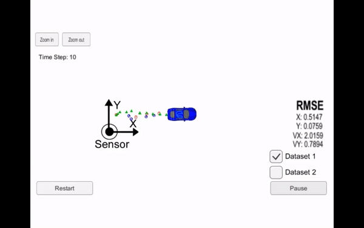

# Udacity Self-Driving Car Engineer Nanodegree Program Projects

## Projects

### 01. [Finding Lane Lines on a Road](https://github.com/PraveenKumar-Rajendran/CarND-LaneLines-P1)

  
Description

  Implemented a pipeline to identify lane lines on the road using fundamental computer vision techniques. The project involved edge detection, region of interest selection, and the Hough transform to detect lane lines in both images and video streams.

### 02. [Advanced Lane Finding](https://github.com/PraveenKumar-Rajendran/CarND-Advanced-Lane-Lines)

  
Description

  Developed an advanced lane detection pipeline by incorporating techniques such as distortion correction, color transforms, gradient thresholding, and perspective transformation. The pipeline was designed to detect lane lines under various driving conditions.

### 03. [Traffic Sign Classifier](https://github.com/PraveenKumar-Rajendran/CarND-Traffic-Sign-Classifier-Project)

  
Description

  Built a deep learning model using a convolutional neural network (CNN) to classify traffic signs from the GTSRB dataset. The model was trained and validated using TensorFlow, achieving high accuracy in predicting the correct traffic sign category.

### 04. [Behavioral Cloning](https://github.com/PraveenKumar-Rajendran/CarND-Behavioral-Cloning)

  
Description

  Trained a deep neural network to autonomously drive a car in a simulator. The network learned to predict the steering angle based on input images from the car's camera, effectively mimicking human driving behavior using supervised learning.

### 05. [Extended Kalman Filter](https://github.com/PraveenKumar-Rajendran/CarND-Extended-Kalman-Filter-Project)

  
Description

  Implemented an Extended Kalman Filter (EKF) in C++ for sensor fusion to accurately track the position and velocity of a moving vehicle using noisy lidar and radar data. The EKF was tested and validated in various scenarios, demonstrating robust tracking performance.

### 06. [Kidnapped Vehicle](https://github.com/PraveenKumar-Rajendran/CarND-Kidnapped-Vehicle-Project)

  
Description

  Developed a particle filter for vehicle localization, simulating a scenario where the vehicle’s initial position is unknown (a "kidnapped vehicle"). The filter processed sensor data to accurately estimate the vehicle’s position on a known map.

### 07. [Highway Driving](https://github.com/PraveenKumar-Rajendran/CarND-Path-Planning-Project)

  
Description

  Created a path planning algorithm to navigate a self-driving car along a highway. The algorithm considered other vehicles, speed limits, and safety requirements to plan and execute safe, comfortable driving trajectories.

### 08. [PID Controller](https://github.com/PraveenKumar-Rajendran/CarND-PID-Control-Project)

  
Description

  Implemented a Proportional-Integral-Derivative (PID) controller in C++ to control the steering angle of a vehicle. The controller was tuned to navigate the vehicle around a race track, balancing responsiveness and stability.

### 09. [Programming a Real Self-Driving Car](https://github.com/PraveenKumar-Rajendran/CarND-Capstone)

  
Description

  Applied the knowledge gained throughout the Nanodegree to program and control Carla, Udacity's self-driving car, on a test track. This capstone project involved integrating perception, planning, and control modules using the Robot Operating System (ROS).

## Udacity - Graduation Certificate

Check out the Syllabus [here](./assets/SDCND_2020_Syllabus.pdf)